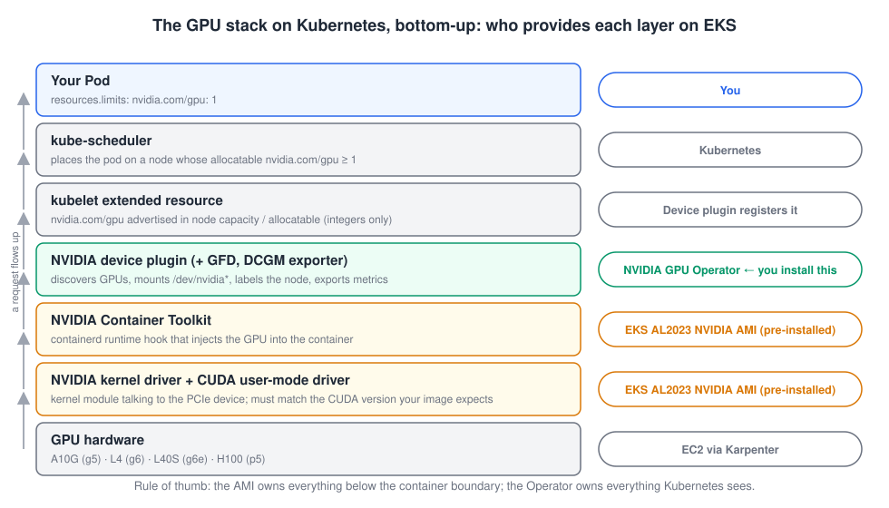

# Module 1 · Why GPUs on Kubernetes are hard

<div class="ws-meta" markdown>
<span>**Format:** talk + live demo</span>
<span>**Time:** 20 min</span>
<span>**Hands-on:** none — but keep a terminal open</span>
</div>

**Goal:** by the end of this module you can draw the GPU stack from the silicon up to your pod spec, and say which layer each thing you'll install in Lab 1 lives in.

## The gap

Kubernetes was designed for resources that are **fungible and divisible**: CPU time can be sliced into millicores, memory into bytes, and the scheduler can pack, preempt and move things around without the workload noticing.

GPUs are none of those things. A GPU is

- **expensive** — a `g5.xlarge` costs five to ten times what a general-purpose node with the same vCPU count costs, and a `p5.48xlarge` runs about $100 an hour On-Demand;
- **stateful** — model weights are loaded into GPU memory over minutes, not milliseconds. Killing a pod to reschedule it is not free;
- **driver-bound** — the container, the host kernel module, and the CUDA runtime in your image all have to agree on versions. A mismatch is a crash, not a warning;
- **indivisible by default** — Kubernetes hands out whole devices. There is no `nvidia.com/gpu: 0.5`.

Everything in this workshop is a technique for living with those four facts.

## The stack, bottom-up



Read it from the bottom:

1. **Hardware.** An EC2 instance with one or more NVIDIA GPUs on the PCIe bus. Karpenter will pick these for us.
2. **Kernel driver + CUDA user-mode driver.** The kernel module that talks to the device, plus `libcuda.so`. The *driver* version determines which CUDA *runtime* versions your containers can use (newer drivers run older CUDA; not the other way round).
3. **NVIDIA Container Toolkit.** A containerd runtime hook. When a container starts with the right environment (`NVIDIA_VISIBLE_DEVICES`), it bind-mounts `/dev/nvidia*` and the driver libraries into the container. Without it, your container sees no GPU no matter what Kubernetes promised it.
4. **NVIDIA device plugin.** A DaemonSet that talks to kubelet's device-plugin API: "this node has 1 GPU". Kubelet then advertises `nvidia.com/gpu: 1` as an **extended resource** in the node's capacity and allocatable, and sets `NVIDIA_VISIBLE_DEVICES` on containers that requested it. Its friends: **GPU Feature Discovery** (labels the node with `nvidia.com/gpu.product`, `.memory`, `.count`…) and **DCGM exporter** (Prometheus metrics).
5. **kube-scheduler.** Sees `nvidia.com/gpu` like any other resource and places your pod on a node with enough allocatable.
6. **Your pod.** `resources.limits: {nvidia.com/gpu: 1}`.

The **NVIDIA GPU Operator** is a Kubernetes operator that manages layers 2–4 as DaemonSets. On a bare Ubuntu node it installs the driver and the toolkit too. On EKS, as you'll see, you turn those two off.

## What `nvidia.com/gpu: 1` actually does

```yaml
resources:
  limits:
    nvidia.com/gpu: 1
```

Three rules, straight from the Kubernetes extended-resources contract:

- **Integers only.** `0.5` and `500m` are rejected by the API server.
- **Requests must equal limits.** Extended resources cannot be overcommitted. Specifying only `limits` is the idiom — Kubernetes copies it to `requests`.
- **No sharing** — a GPU counted as `1` is handed to exactly one container. Sharing (Module 3) works by making the device plugin *lie* and advertise more than one.

The scheduler only knows the number. It does not know GPU memory, model, or utilisation. That's why node labels from GPU Feature Discovery matter: `nodeSelector: {nvidia.com/gpu.product: NVIDIA-A10G}` is how you say "I need 24 GB".

## Where EKS helps (and where it doesn't)

| Layer | Generic Kubernetes | Amazon EKS (AL2023 NVIDIA AMI) | EKS Auto Mode |
|-------|-------------------|-------------------------------|---------------|
| Driver | you install | **in the AMI** | in the AMI |
| Container toolkit | you install | **in the AMI**, `nvidia` is containerd's default runtime | in the AMI |
| Device plugin | you install | **you install** (GPU Operator or plain device-plugin chart) | AWS-managed, invisible |
| Node provisioning | Cluster Autoscaler / Karpenter | Karpenter (you install) | Karpenter (AWS-managed) |
| Time-slicing / MIG config | you configure | you configure via the Operator | limited |

The EKS-optimised **AL2023 NVIDIA AMI** ships the driver, the CUDA user-mode driver, the container toolkit and even the fabric manager for multi-GPU instances. What it does **not** ship is the device plugin — AWS says so explicitly. You'll install that as part of the GPU Operator in Lab 1, with `driver.enabled=false` and `toolkit.enabled=false`.

**EKS Auto Mode** goes further and manages the device plugin for you. It's a great default for teams that don't want to own this layer. We're deliberately *not* using it today, because you can't learn what a layer does by having it hidden — and because the sharing configuration we do in Module 3 is something you own on standard EKS.

## Live demo: a CPU node vs a GPU node

The presenter's cluster already has a GPU node. On yours there is none yet, which is also part of the demo. Run this on your cluster:

```bash
kubectl get nodes -o custom-columns='NAME:.metadata.name,INSTANCE:.metadata.labels.node\.kubernetes\.io/instance-type,GPU:.status.allocatable.nvidia\.com/gpu,PRODUCT:.metadata.labels.nvidia\.com/gpu\.product'
```

<div class="ws-output" markdown>
```text
NAME                          INSTANCE     GPU      PRODUCT
ip-10-0-11-23.ec2.internal    m6i.xlarge   <none>   <none>
ip-10-0-42-118.ec2.internal   m6i.xlarge   <none>   <none>
```
</div>

And this is what the presenter's GPU node shows for the same command, plus a `describe`:

<div class="ws-output" markdown>
```text
NAME                          INSTANCE     GPU   PRODUCT
ip-10-0-7-201.ec2.internal    g5.xlarge    1     NVIDIA-A10G

$ kubectl describe node ip-10-0-7-201.ec2.internal | grep -A8 '^Capacity'
Capacity:
  cpu:                4
  ephemeral-storage:  209702892Ki
  hugepages-1Gi:      0
  hugepages-2Mi:      0
  memory:             16069100Ki
  nvidia.com/gpu:     1
  pods:               58
```
</div>

Note where `nvidia.com/gpu: 1` sits: right next to `cpu` and `memory`, as a peer. Kubernetes doesn't know it's special. Everything that makes it special lives in the DaemonSets you'll install next.

## Questions that always come up

??? question "Does this work with AMD GPUs / ROCm?"
    The pattern is identical — AMD ships its own device plugin and GPU Operator — but the AMIs, labels and metrics are different, and EC2's AMD-GPU instance families are narrower. Everything in this workshop is NVIDIA-specific in the details.

??? question "Windows nodes?"
    No. Not for GPU inference, not today.

??? question "Can I request half a GPU?"
    Not with `nvidia.com/gpu`. Module 3 shows the three ways to share a GPU (time-slicing, MIG, MPS) and why each exists.

??? question "What about Dynamic Resource Allocation (DRA)?"
    DRA is the successor to device plugins: pods claim devices through `ResourceClaim` objects with structured parameters, and the scheduler can reason about GPU attributes instead of a bare integer. It went GA in Kubernetes 1.34. AWS now recommends the NVIDIA DRA driver for *static* GPU capacity on 1.34+, and still recommends the device plugin with Karpenter (dynamic capacity) — which is us. We use the device plugin today and point you at DRA in the wrap-up.

[Next: Lab 1 →](../02-lab1-gpu-ready-eks/index.md)
