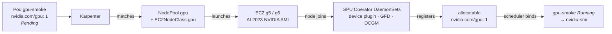

# Module 2 · Lab 1: a GPU-ready EKS cluster

**Format:** hands-on lab
**Time:** 50 min (incl. 5 min buffer)
**Cost:** one GPU node, ≈ $0.35–1.00/hour depending on Spot

**Goal:** a GPU node running, the NVIDIA GPU Operator installed correctly for EKS, and your first CUDA container printing `nvidia-smi` output.

You start with a cluster that has never seen a GPU. You'll add each layer of the stack yourself, in the order the request flows through them:

## Steps

| Step | What you do | Layer |
|------|-------------|-------|
| [2.1 Verify the base stack](01-verify.md) | Confirm Karpenter, Prometheus and KEDA are up and there are no GPU nodes | — |
| [2.2 Create GPU capacity](02-nodepool.md) | Pin an AMI, write an `EC2NodeClass` and a `NodePool` for g5/g6 Spot with On-Demand fallback, taint the nodes | hardware, driver, toolkit |
| [2.3 Install the GPU Operator](03-gpu-operator.md) | Helm install with `driver.enabled=false` — and understand why | device plugin, GFD, DCGM |
| [2.4 Your first GPU pod](04-first-gpu-pod.md) | Deploy a CUDA pod, watch Karpenter launch the node, read `nvidia-smi` | scheduler, pod |
| [2.5 Checkpoint](05-checkpoint.md) | Validate, screenshot, take a break | |

!!! checkpoint "Hard gate"
    Nobody goes to break without `nvidia-smi` output from their own cluster on screen. If you're stuck, raise your hand (or drop a message in the chat) *early* — the helpers are here for exactly this.

Everything you apply in this lab lives under [`modules/01-gpu-nodes/`](https://github.com/abebars/gpu-eks-workshop/tree/main/modules/01-gpu-nodes) and [`modules/02-gpu-operator/`](https://github.com/abebars/gpu-eks-workshop/tree/main/modules/02-gpu-operator) in the repo.

[Start with 2.1 →](01-verify.md)
