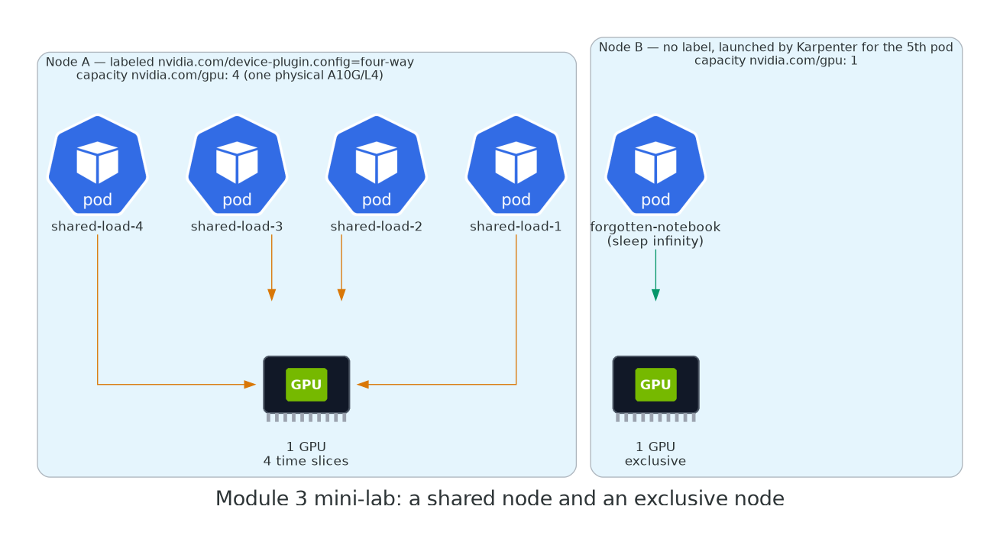

# 3.4 The fifth pod

<div class="ws-meta" markdown>
<span>**Time:** 4 min (plus ~3 min of EC2 in the background)</span>
<span>**Creates:** Pod `forgotten-notebook` and, because it can't fit, a second GPU node</span>
</div>

Node A is full: four slices, four pods. Now a fifth workload arrives. It's a data scientist's notebook — it asks for a whole GPU and then does absolutely nothing with it. Every GPU fleet has one.

```yaml title="modules/03-sharing/forgotten-notebook.yaml"
--8<-- "modules/03-sharing/forgotten-notebook.yaml"
```

```bash
kubectl apply -f modules/03-sharing/forgotten-notebook.yaml
kubectl get pod forgotten-notebook -w
```

<div class="ws-output" markdown>
```text
NAME                 READY   STATUS    RESTARTS   AGE
forgotten-notebook   0/1     Pending   0          0s
```
</div>

Pending — no node has a free `nvidia.com/gpu`. Your watch pane from Lab 1 shows Karpenter reacting within seconds:

<div class="ws-output" markdown>
```text
nodeclaim.karpenter.sh/gpu-9wq4d   g5.xlarge   spot   us-east-1a                                Unknown   0s
```
</div>

While it boots (~3 min), think about what's *not* going to happen: the new node will not be time-sliced. The ConfigMap is cluster-wide, but the config only applies to nodes carrying the `nvidia.com/device-plugin.config` label, and Karpenter creates nodes with the labels in the NodePool template — which doesn't include it. So node B comes up **exclusive**: `nvidia.com/gpu: 1`.

<div class="ws-output" markdown>
```text
forgotten-notebook   0/1     Pending             0          2m58s
forgotten-notebook   0/1     ContainerCreating   0          3m01s
forgotten-notebook   1/1     Running             0          3m09s
```
</div>

## Two nodes, two policies

```bash
kubectl get nodes -l karpenter.sh/nodepool=gpu -o custom-columns='NAME:.metadata.name,INSTANCE:.metadata.labels.node\.kubernetes\.io/instance-type,GPU:.status.allocatable.nvidia\.com/gpu,PRODUCT:.metadata.labels.nvidia\.com/gpu\.product,CONFIG:.metadata.labels.nvidia\.com/device-plugin\.config'
```

<div class="ws-output" markdown>
```text
NAME                         INSTANCE    GPU   PRODUCT            CONFIG
ip-10-0-23-77.ec2.internal   g6.xlarge   4     NVIDIA-L4-SHARED   four-way
ip-10-0-5-140.ec2.internal   g5.xlarge   1     NVIDIA-A10G        <none>
```
</div>

{ width="760" }

That is a mixed fleet in one NodePool: a shared node for the four small jobs, an exclusive node for the one that (claims it) needs a whole card. The production version of this is two NodePools — `gpu-shared` with `nvidia.com/device-plugin.config: four-way` in its **template labels** so every node it creates is sliced on arrival, and `gpu-exclusive` without — and workloads pick with a `nodeSelector`. Same mechanism, zero manual labelling.

??? example "What that NodePool template looks like"
    ```yaml
    apiVersion: karpenter.sh/v1
    kind: NodePool
    metadata:
      name: gpu-shared
    spec:
      template:
        metadata:
          labels:
            nvidia.com/device-plugin.config: four-way   # sliced on arrival
            gpu-tier: shared
        spec:
          # ...same requirements, taint and nodeClassRef as the gpu pool
    ```

    Then in a dev-notebook Deployment: `nodeSelector: {gpu-tier: shared}`. In the inference Deployment: `nodeSelector: {gpu-tier: exclusive}` or `nvidia.com/gpu.product: NVIDIA-A10G` (which the `-SHARED` suffix will never match).

## Leave the notebook running

Don't delete `forgotten-notebook`. It's holding a $1/hour GPU at 0% utilisation and it will keep doing that through Lab 2. In Module 5 you'll find it from the dashboards, which is how you'll find the real ones.

[Next: 3.5 Reset for Lab 2 →](05-reset.md)
