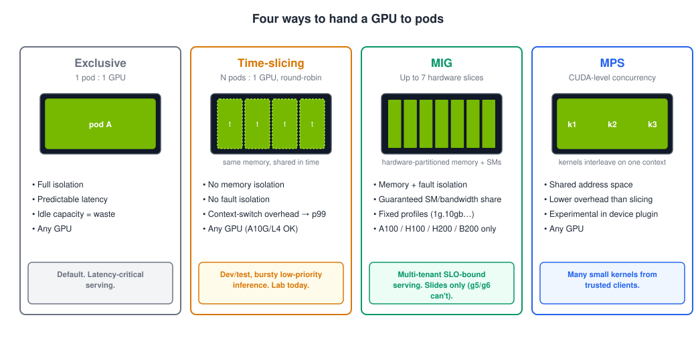

# Module 3 · GPU scheduling & sharing

**Format:** talk (25 min) + mini-lab (15 min)
**Time:** 40 min
**Cost:** a second GPU node appears during the mini-lab

**Goal:** you can choose between exclusive GPUs, time-slicing, MIG and MPS — and defend the choice.

## Do this first (30 seconds)

Before the talk starts, kick off [3.1 Warm the image cache](01-prepull.md). It pre-pulls the 9 GB vLLM image onto your GPU node while we talk, so Lab 2 doesn't start with a five-minute download. Go do it now; come back.

## Scheduling mechanics, in five lines

1. `nvidia.com/gpu` is an **extended resource**: integer, requests == limits, never overcommitted.
2. The scheduler sees only the integer. To pick a GPU *model* you use **GFD labels**: `nodeSelector: {nvidia.com/gpu.product: NVIDIA-A10G}` or an affinity on `nvidia.com/gpu.memory`.
3. GPU nodes are **tainted**; GPU pods **tolerate**. Everything else stays off.
4. **Karpenter** watches for Pending pods it could satisfy, launches the cheapest node that fits, and waits for `nvidia.com/gpu` to register before it counts the node as initialised.
5. **Scale-down** is a policy decision, not a default: `WhenEmpty` for inference fleets, with a `consolidateAfter` you chose on purpose.

## The utilisation problem

Most inference workloads don't saturate a GPU. A 1.5B-parameter model serving a handful of concurrent users uses a slice of an A10G's compute and a fraction of its 24 GB. Meanwhile the scheduler hands out GPUs as whole units, so the *other* 70% of that card is idle — and idle GPU is the single largest line item in most AI platform bills. Every sharing technique exists to close that gap, and each one gives something up for it.

### Exclusive (the default)

One pod, one GPU, full isolation, predictable latency. The right answer for latency-critical serving and for anything with a strict SLO. The wrong answer for dev environments, notebooks, batch scoring and small models — which is most of the fleet.

### Time-slicing

The device plugin advertises **N replicas** of each GPU (`nvidia.com/gpu: 4` on a node with one card), and the GPU's own scheduler round-robins between the processes. Configured in a ConfigMap; opt nodes in with a label. Works on **every** GPU including A10G and L4.

What you give up: **no memory isolation** (one pod can OOM another), **no fault isolation** (one pod's Xid error can take down the others), and **context-switch overhead** that shows up as p99 latency. Also: DCGM can no longer attribute utilisation to individual containers on a sliced node — you lose per-pod GPU metrics.

Use it for dev/test, notebooks, bursty low-priority inference. Don't use it for anything with a latency SLO. This is what the mini-lab does.

### MIG — Multi-Instance GPU

Hardware partitioning. An A100 or H100 is carved into up to **seven** slices, each with its own memory, SMs and cache — real isolation, guaranteed bandwidth, predictable latency. Profiles are fixed (`1g.10gb`, `2g.20gb`, `3g.40gb`…), configured per node via the MIG manager and a `nvidia.com/mig.config` label, and exposed as `nvidia.com/mig-1g.10gb` resources.

What you give up: flexibility (fixed profiles), and **hardware choice**: MIG exists on A100, A30, H100, H200, B200 and newer. **Not on A10G (g5), L4 (g6) or L40S (g6e)** — which is exactly why today's lab uses time-slicing and MIG is slides only. On EKS, MIG is the right tool for multi-tenant SLO-bound serving on p4/p5-class nodes.

### MPS — Multi-Process Service

CUDA-level concurrency: multiple processes share one GPU *context*, so kernels from different clients can run concurrently instead of time-sliced. Lower overhead than slicing, memory limits per client, but a shared address space (trust your tenants) and, in the Kubernetes device plugin, still labelled experimental. Mention-level today.

### Choosing

| You need… | Use |
|-----------|-----|
| Strict latency SLO, production serving | Exclusive (or MIG on A100/H100) |
| Isolation between tenants on big GPUs | MIG |
| Higher utilisation for dev/test/notebooks/bursty jobs on any GPU | Time-slicing |
| Many small kernels from one trusted team, lowest overhead | MPS |
| Fractional GPUs *as a first-class scheduler concept* | DRA (Kubernetes 1.34+), not today |

## Karpenter and GPU fleets

Scale-up is the easy part: Pending pod → node in ~3 minutes, as you saw. The things that go wrong are on the other side:

- **Consolidation** — `WhenEmptyOrUnderutilized` will replace a running inference node with a cheaper one. You want `WhenEmpty` plus an intentional `consolidateAfter`.
- **Spot interruptions** — EC2 gives two minutes' warning. Karpenter (via the interruption queue from the base stack) cordons and drains the node. Your model server needs a `terminationGracePeriodSeconds` long enough to finish in-flight requests, a PodDisruptionBudget, and at least two replicas if the SLO matters. A single Spot replica of anything user-facing is a choice you're making, not an accident.
- **Limits** — `limits.nvidia.com/gpu` on the NodePool. Always.
- **Expiry** — `expireAfter` (default 30 days) rolls nodes for driver/AMI hygiene. Make sure your workloads can survive it before it surprises you at 3 a.m.

## Mini-lab

| Step | What happens |
|------|--------------|
| [3.1 Warm the image cache](01-prepull.md) | (already done) a DaemonSet pre-pulls vLLM onto every GPU node |
| [3.2 Time-slice a node](02-time-slicing.md) | ConfigMap + node label → your Lab 1 node advertises `nvidia.com/gpu: 4` |
| [3.3 Four pods, one GPU](03-four-pods.md) | Four GPU pods land on one card; `nvidia-smi` shows four processes |
| [3.4 The fifth pod](04-fifth-pod.md) | A fifth pod can't fit → Karpenter launches a second, *unsliced* node |
| [3.5 Reset for Lab 2](05-reset.md) | Un-slice the node; leave the fifth pod running (you'll meet it again) |

[Start with 3.1 →](01-prepull.md)
