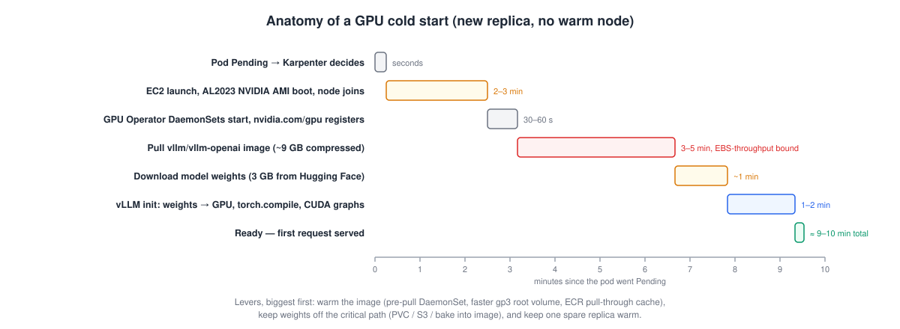

# 4.6 Cold start, live

<div class="ws-meta" markdown>
<span>**Time:** 8 min, overlapping with replica 2's start</span>
</div>

Replica 1 was ready ~4 minutes after `kubectl apply`. Replica 2 will take ~9. The difference is everything that was warm on node A and cold on node C. Time it while it happens.



## Measure it

Pull the timestamps from the pod's events and the node's:

```bash
POD2=$(kubectl -n vllm get pods -l app=vllm --sort-by=.metadata.creationTimestamp -o jsonpath='{.items[-1].metadata.name}')
kubectl -n vllm get events --field-selector involvedObject.name=$POD2 --sort-by=.lastTimestamp \
  -o custom-columns='TIME:.lastTimestamp,REASON:.reason,MESSAGE:.message'
```

<div class="ws-output" markdown>
```text
TIME                   REASON            MESSAGE
2026-09-17T14:52:31Z   Nominated         Pod should schedule on: nodeclaim/gpu-c3ptx
2026-09-17T14:55:18Z   Scheduled         Successfully assigned vllm/vllm-7b9d6c4f8-zr8hk to ip-10-0-31-9.ec2.internal
2026-09-17T14:55:20Z   Pulling           Pulling image "vllm/vllm-openai:v0.28.0"
2026-09-17T14:59:04Z   Pulled            Successfully pulled image "vllm/vllm-openai:v0.28.0" in 3m44s
2026-09-17T14:59:05Z   Created           Created container vllm
2026-09-17T14:59:05Z   Started           Started container vllm
```
</div>

And from the log, the two remaining phases:

```bash
kubectl -n vllm logs $POD2 | grep -E 'model.safetensors: 100%|init engine|startup complete'
```

<div class="ws-output" markdown>
```text
model.safetensors: 100%|██████████| 3.09G/3.09G [00:58<00:00, 53.1MB/s]
INFO 09-17 15:01:12 [core.py] init engine (profile, create kv cache, warmup model) took 46.02 seconds
INFO:     Application startup complete.
```
</div>

Fill in your own table:

| Phase | Started | Took | Lever |
|-------|---------|------|-------|
| Pending → node nominated | `Nominated` | seconds | — |
| Node launch + join + GPU registered | `Nominated` → `Scheduled` | **~2.8 min** | instance warm pools · keep a spare node |
| Image pull | `Pulling` → `Pulled` | **~3.7 min** | pre-pull DaemonSet · faster EBS · smaller image · ECR pull-through cache |
| Weights download | `Started` → `100%` | ~1 min | PVC / hostPath cache · S3 Mountpoint · bake into image |
| Engine init | `100%` → `startup complete` | ~1 min | `--load-format` · compile cache volume · smaller `max-model-len` |
| **Total** | | **~9 min** | |

## The levers, biggest first

**1. Don't pull the image on the critical path.** You already have the pre-pull DaemonSet — it landed on node C too, but *simultaneously* with the vLLM pod, so it didn't help this time. It helps the *next* pod on that node, and every node that exists before load arrives. Combine it with the `blockDeviceMappings` throughput you set in Lab 1 (500 MB/s vs. the 125 MB/s gp3 default), an **ECR pull-through cache** so the 9 GB comes from ECR in-region rather than Docker Hub through your NAT gateway, and a slimmer image if you can build one.

**2. Don't download weights on the critical path.** Options, in increasing effort: a `hostPath` cache so replicas on the same node share weights; a `ReadWriteMany` volume (EFS) or a per-AZ PVC snapshot; **Mountpoint for S3** to stream weights from a bucket in-region; or bake the weights into the image (fast, but now every model change is an image build). For a 3 GB model the download is a minute; for a 70B model it's the whole cold start.

**3. Keep one replica of headroom.** The cheapest way to hide a 9-minute cold start is to never need it at zero notice: `minReplicaCount: 2`, or a lower `threshold` so scale-out starts before saturation. That's a cost/latency trade you make with a number, not an architecture.

**4. Keep a warm node.** A NodePool with `consolidateAfter: 30m` and a `PodDisruptionBudget` keeps the last node around between bursts. Karpenter can't launch an EC2 instance faster than EC2 can boot it; the only way to beat ~3 minutes is to not need a new one.

**5. Shrink engine init.** `--max-model-len` sizes the KV cache profile; a persistent volume at `~/.cache/vllm` keeps the `torch.compile` artifacts between restarts. Minor next to the first two, but free.

!!! quirk "Spot makes cold starts *more* likely, not just cheaper"
    A Spot reclaim gives you two minutes' notice, and the replacement node goes through this entire timeline. If your SLO can't absorb a 9-minute capacity dip, either run two replicas on different nodes, keep an On-Demand floor (`minReplicaCount` pinned to an on-demand NodePool via `nodeSelector`), or both.

When replica 2 shows `1/1 Ready`, go back to [4.5](05-autoscale.md#when-replica-2-is-serving) and finish the load test. Then run the validator:

```bash
./scripts/validate-lab2.sh
```

<div class="ws-output" markdown>
```text
Lab 2 validation
  ✅ vllm Deployment has 2 ready replica(s)
  ✅ chat completion returned: ready
  ✅ PodMonitor vllm exists
  ✅ KEDA ScaledObject vllm is Ready (HPA keda-hpa-vllm)
🎉 Lab 2 checkpoint reached.
```
</div>

[Next: Module 5 →](../05-observability-and-cost/index.md)
