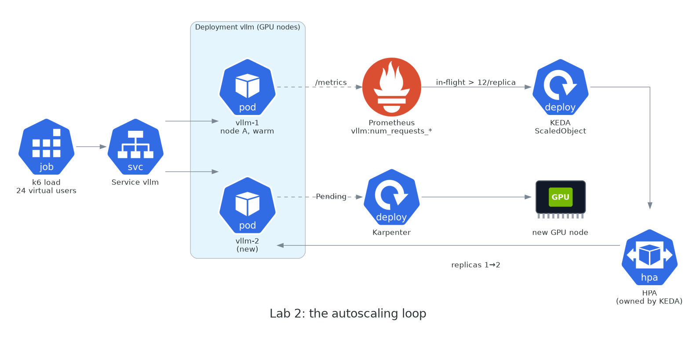

# Module 4 · Lab 2: serving a real model

**Format:** hands-on lab
**Time:** 50 min (incl. 5 min buffer)
**Cost:** up to three GPU nodes for ~30 min

**Goal:** a real LLM served from your GPU nodes through an OpenAI-compatible API, load-tested, and autoscaling — with Karpenter adding a GPU node behind the autoscaler while you watch.

{ width="820" }

## The model and the server

- **vLLM** — the de-facto open-source inference server: continuous batching, paged KV cache, an OpenAI-compatible HTTP API, and Prometheus metrics out of the box. One container image, one process per GPU.
- **`Qwen/Qwen2.5-1.5B-Instruct`** — 1.5 billion parameters, Apache-2.0, **not gated** (no Hugging Face token, no click-through licence), a single 3 GB safetensors file. Small enough to download in a minute and to leave most of a 24 GB A10G/L4 for KV cache, big enough to give coherent answers. Swap in anything else later; the manifest doesn't care.

## Steps

| Step | What you do | Time |
|------|-------------|------|
| [4.1 Deploy vLLM](01-deploy.md) | Namespace, Deployment, Service, PodMonitor. The pod lands on your warm node. | 3 min |
| [4.2 Walk the manifest](02-manifest.md) | While it starts: probes, shared memory, the weights cache, resources — every line that's there for a GPU reason | 8 min |
| [4.3 Smoke test](03-smoke-test.md) | `curl` a chat completion from your own endpoint. **Checkpoint 3.** | 5 min |
| [4.4 Load test](04-load-test.md) | One minute of k6 against one replica: watch it saturate and queue | 6 min |
| [4.5 Autoscale](05-autoscale.md) | KEDA ScaledObject on requests in flight → HPA → replica 2 → Karpenter → node C | 15 min |
| [4.6 Cold start, live](06-cold-start.md) | Time every phase of replica 2's start, and see which levers you already pulled | 8 min |

!!! checkpoint "Hard gate"
    Checkpoint 3 is a completion — real generated text — returned from **your** endpoint. It comes early in the lab (4.3) on purpose: once you have it, everything after is about making it faster and bigger.

[Start with 4.1 →](01-deploy.md)
