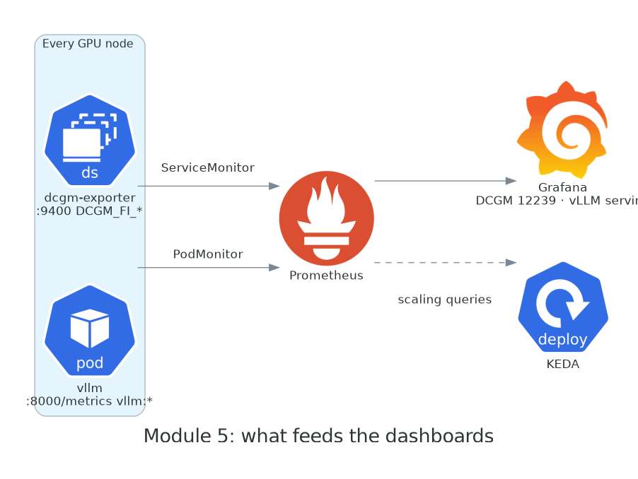

# Module 5 · Observability & cost

**Format:** talk + guided demo
**Time:** 25 min
**Ends with:** two fewer GPU nodes than you started with

**Goal:** you know which five GPU metrics to put on a dashboard, you can find an idle GPU in under a minute, and you can rank the cost levers by impact.

{ width="760" }

The pipeline was built for you in the base stack and Lab 1: **dcgm-exporter** (a GPU Operator DaemonSet) exposes hardware metrics on every GPU node; the Operator's ServiceMonitor and your PodMonitor tell **Prometheus** to scrape them and vLLM; **Grafana** has the NVIDIA DCGM dashboard pre-imported and the vLLM dashboard you applied in 4.1; **KEDA** reads the same Prometheus. One source of truth for humans and autoscalers.

## The metrics that matter

You'll see dozens of `DCGM_FI_*` series. These are the ones that answer real questions:

| Question | Metric | Healthy looks like |
|----------|--------|--------------------|
| Is the GPU doing anything? | `DCGM_FI_DEV_GPU_UTIL` | High during load. **Near 0 with a pod scheduled = money on fire.** |
| Is it doing *useful* work or just busy? | `DCGM_FI_PROF_SM_ACTIVE`, `DCGM_FI_PROF_PIPE_TENSOR_ACTIVE` | `GPU_UTIL` can read 100% while SMs idle; these show the compute pipes actually active. Tensor-pipe activity is the LLM-relevant one. |
| Am I about to OOM? | `DCGM_FI_DEV_FB_USED` / `FB_FREE` | vLLM pre-allocates (`--gpu-memory-utilization`), so this is flat by design; a climb means a leak or a second tenant. |
| Is it throttling? | `DCGM_FI_DEV_GPU_TEMP`, `DCGM_FI_DEV_POWER_USAGE`, `DCGM_FI_DEV_SM_CLOCK` | Clock dropping while power sits at cap = thermal/power throttling. Rare in EC2, real in your own racks. |
| Is it broken? | `DCGM_FI_DEV_XID_ERRORS` | Zero. Any Xid is a page. |
| **Who** is using it? | any of the above with `pod`, `namespace`, `container` labels | Per-pod attribution — works on exclusive GPUs, **not on time-sliced ones** (DCGM can't attribute a shared card). |

And from vLLM, the serving-side view: `vllm:num_requests_running` / `waiting` (load and saturation), `vllm:kv_cache_usage_perc` (headroom), `vllm:time_to_first_token_seconds` (what queued users feel), `vllm:e2e_request_latency_seconds` (the SLO), `vllm:generation_tokens_total` (throughput and the thing you bill on).

!!! tip "The one alert to ship first"
    `avg_over_time(DCGM_FI_DEV_GPU_UTIL[30m]) < 5` on a node that has a GPU pod scheduled. It catches forgotten notebooks, crashed workers that kept their allocation, and "we scaled up for the launch" clusters nobody scaled down. It will pay for the monitoring stack in its first week.

## The money slide

What this workshop cluster costs per hour, us-east-1 On-Demand list prices at the time of writing (check the EC2 pricing page — they move):

| Component | Qty | $/hour |
|-----------|-----|--------|
| EKS control plane | 1 | 0.10 |
| System nodes `m6i.xlarge` | 2 | 0.38 |
| NAT gateway | 1 | 0.05 |
| GPU node `g5.xlarge` (A10G) | up to 3 | 1.01 each · **~3.02** |
| *or* `g6.xlarge` (L4) | | 0.80 each |
| **Peak, all On-Demand** | | **≈ $3.55** |
| **Peak, GPUs on Spot** (typ. 60–70% off) | | **≈ $1.50** |

The base stack is noise. The GPUs are the bill, and the multiplier that matters is **hours × idleness**:

- A fleet of 20 × `g5.xlarge` running 24/7 is 20 × 1.01 × 730 h ≈ **$14,700/month**.
- At the 30% average utilisation most inference fleets actually see, **~$10,000 of that is idle GPU.**
- The `forgotten-notebook` pod from Module 3 has been idling a whole GPU for about an hour. One notebook, one hour, one dollar. Multiply by your org.

## Cost levers, in order of impact

1. **Don't idle.** Scale to zero for dev/test (`minReplicaCount: 0` in KEDA), `WhenEmpty` consolidation with a short `consolidateAfter` for the fleet, and the alert above for the leaks. This is 50%+ on most fleets and it costs nothing.
2. **Spot, diversified.** Up to 90% off list per AWS; realistically 60–70% for G-family. Only works with instance diversity, On-Demand fallback, and workloads that survive a 2-minute warning.
3. **Right-size the GPU.** Time-slicing for the small stuff, MIG on A100/H100 for isolation, and the right *family*: an L4 (`g6`) is cheaper than an A10G (`g5`) and often faster for inference. Don't run 1.5B-parameter models on 80 GB cards.
4. **Bin-pack.** `limits` on every NodePool, `WhenEmpty` consolidation, and a `topologySpreadConstraint` only where you actually need AZ spread — spreading three replicas across three AZs means three nodes at 33% instead of one at 100%.
5. **Pin AMIs.** Not a cost lever on paper. In practice, an unplanned fleet roll at 2 p.m. on a Tuesday is the most expensive thing that happens to a GPU platform all quarter.

## Guided demo

| Step | What you do |
|------|-------------|
| [5.1 Open the dashboards](01-dashboards.md) | Grafana: the DCGM dashboard and the vLLM serving dashboard, with your load test still visible |
| [5.2 Find the idle GPU](02-idle-gpu.md) | Query for a GPU with a pod and no utilisation → it's the notebook. Delete it. Then tighten `consolidateAfter` and watch Karpenter reclaim two nodes. |
| [5.3 Cost levers](03-cost-levers.md) | Apply the ranking above to *your* cluster: what would you change on Monday? |

[Start with 5.1 →](01-dashboards.md)
