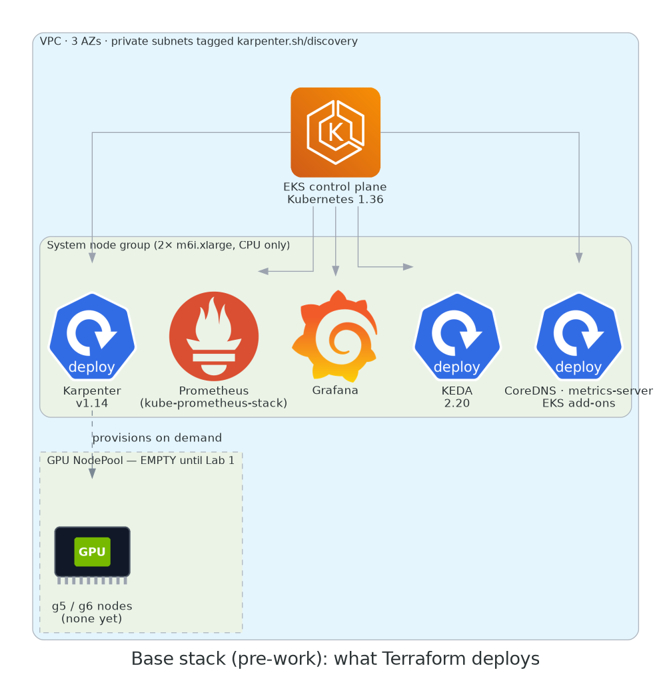
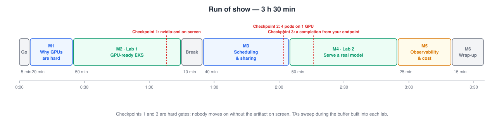

# Engineering GPU Infrastructure for AI Workloads

**A hands-on introduction to GPU inference serving on Amazon EKS.**

**Level:** 300 (intermediate)
**Format:** live, 3 h 30 min
**Hands-on time:** ~2 h
**AWS cost:** ~$15–25 if you tear down afterwards

In three and a half hours you will take an EKS cluster from **zero GPUs** to **serving a real large language model on GPU nodes** — with autoscaling, GPU sharing, and monitoring in place — and leave with a repo that reruns all of it with one command.

This is an *inference* workshop. We serve a live LLM with vLLM. Training (EFA, NCCL, distributed jobs) is out of scope; the wrap-up points you to the right material for it.

## What you will build

{ width="760" }

By the end of Lab 2 your cluster is running:

- a **Karpenter NodePool** that provisions g5/g6 GPU nodes on demand, Spot-first with On-Demand fallback, on a *pinned* AMI;
- the **NVIDIA GPU Operator** configured correctly for EKS (spoiler: with the driver *disabled*);
- a node **time-sliced four ways**, and a second node that is not — and you'll know why you'd want each;
- **vLLM** serving `Qwen2.5-1.5B-Instruct` behind an OpenAI-compatible endpoint;
- **KEDA** scaling vLLM on requests in flight, with Karpenter adding GPU nodes behind it;
- **DCGM → Prometheus → Grafana** dashboards that show you where the money goes.

## Who this is for

Platform and DevOps engineers who are comfortable with Kubernetes basics — you can explain what a Deployment and a Service are, and you have run `kubectl apply` in anger — and who are **new to GPU infrastructure**. No ML background needed. No CUDA knowledge needed.

## Agenda

| # | Segment | Type | Time |
|---|---------|------|------|
| — | Starting now, house rules | | 5 min |
| 1 | [Why GPUs on Kubernetes are hard](01-why-gpus-are-hard/index.md) | talk + demo | 20 min |
| 2 | [Lab 1: a GPU-ready EKS cluster](02-lab1-gpu-ready-eks/index.md) | **lab** | 50 min |
|   | Break | | 10 min |
| 3 | [GPU scheduling & sharing](03-scheduling-and-sharing/index.md) | talk + mini-lab | 40 min |
| 4 | [Lab 2: serving a real model](04-lab2-serving-a-model/index.md) | **lab** | 50 min |
| 5 | [Observability & cost](05-observability-and-cost/index.md) | talk + guided demo | 25 min |
| 6 | [Wrap-up](06-wrap-up/index.md) | | 15 min |

## Before you arrive

!!! danger "Do the pre-work. It is not optional."
    Two things take real calendar time and cannot be done during the session:

    1. **GPU quota.** Fresh AWS accounts have a quota of **zero** for G-family instances. Increases can take 24–48 hours. [Request it today →](00-prework/01-quota.md)
    2. **The base stack.** The EKS control plane, Karpenter and the monitoring stack take ~20 minutes to create. [Deploy it the day before →](00-prework/03-base-stack.md)

    Attendees who arrive without these will watch, not build.

## How the labs work

Every step follows the same shape: **what you're about to do, the command, what you should see, why it matters.** Copy buttons are on every code block. Where EKS behaves differently from a generic Kubernetes cluster, you'll see this:

!!! quirk "EKS quirk"
    The thing that will bite you in production if nobody told you.

And at the end of each lab:

!!! checkpoint "Checkpoint"
    The one artifact you must have on screen before moving on. Checkpoints 1 and 3 are hard gates — nobody gets left behind; checkpoint 2 is a quick show of hands.

## Conventions

- Commands are for a POSIX shell (macOS, Linux, WSL). Every command is run from the root of the companion repo.
- `$` is the prompt; don't type it. Output blocks are illustrative — names, IDs and timings will differ.
- The companion repo is [`abebars/gpu-eks-workshop`](https://github.com/abebars/gpu-eks-workshop). Manifests shown in the guide are the *actual files* in `modules/`, embedded at build time, so what you read is what you apply.

Ready? [Start the pre-work →](00-prework/index.md)
